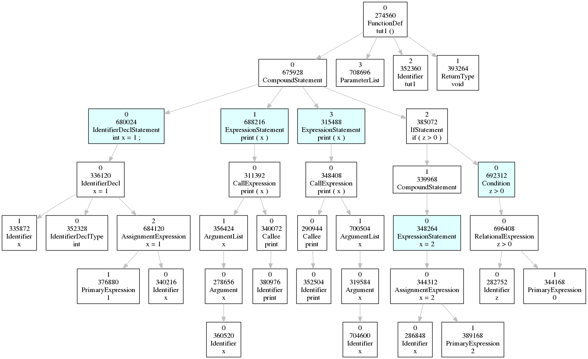

AST Traversals
===============

We have seen how to get to function nodes. One of the ways of looking at a function is by the abstract syntax tree (AST). In a typical parser, function definitions are part of a bigger AST, but in the Joern graph, a function definition is the top node of the AST. It has type ``FunctionDef``. Its children can be found by following edges with label ``IS_AST_PARENT``.

Repetitions
-----------

It is easy to find the AST children, but how about the children's children, and their children. We do not know how many levels of children we need to go, so we need another way: the ``repeat`` step.

``repeat`` applies a traversal repeatedly. It will take the input and feed the output of the traversal back into itself as input. To traverse all AST nodes, we could use:

.. code-block:: groovy

        g.V()
        .has('type','File')
        .has('code',textRegex('.*tut1.c'))
        .out('IS_FILE_OF')
        .out('IS_FUNCTION_OF_AST')
        .repeat( out('IS_AST_PARENT') )

This traversal will not result in anything though. We need to ``emit`` the elements that are visited. The ``emit`` step can be called before ``repeat`` or after ``repeat``. Used before ``repeat``, the element is emitted before the traversal is applied. Used after ``repeat``, the element is emitted after the traversal, which, if not succesful, will not emit the element.

In this example, if we add ``.emit()`` after the ``repeat`` step, we will not see the ``FunctionDef`` node in the results. If we add it before ``repeat``, we will.

.. code-block:: groovy

        g.V()
        .has('type','File')
        .has('code',textRegex('.*tut1.c'))
        .out('IS_FILE_OF')
        .out('IS_FUNCTION_OF_AST')
        .emit()
        .repeat( out('IS_AST_PARENT') )

The above repetition will continue until all paths are exhausted. Sometimes we would like to put a limit on the repetition. There are two ways to do this. The first is to use the step ``times``. It takes a number and tries to repeat the traversal that many times. With the AST traversal, adding ``times(3)`` would traverse the AST up to and including three levels below the root node.

The other way to limit repetitions is to use ``until``. This adds a condition to the repetition. If ``until`` is put before ``repeat``, the condition is checked and if the condition holds, then the traversal is executed. This is similar to a ``while`` loop in programming languages such as C or Java. If ``until`` is put after the repeat, the traversal is first executed, and then the condition is checked. In Java or C, this would be a ``do ... while`` loop.

Note that when a repetition ends, the traversal is seen as succesful and the element will be added to the output. This is important to know, especially if you also have an ``emit`` step in your repetition. If you put the ``until`` or the ``emit`` in the wrong place, you may get duplicate results.

This repetition traversed a graph that had no cycles. In the section on CFG traversals we will see how we can avoid non-terminating repetitions if there are cycles in the graph.

Plotting the AST
----------------

Suppose we want to lookup the function ``tut1`` in the project ``testCode.tar.gz``.  First, we need to lookup the function:

.. code-block:: bash

        joern-list-funcs -p tut1 -F' ' testCode.tar.gz

This will give us the function information:

.. code-block:: none

        331776 tut1 /home/tim/RESEARCH/OCTOPUS/timhemel-joern-dev/projects/octopus/data/projects/testCode.tar.gz/src/testCode/tut1.c

The first number is important, we need to feed that to joern-plot-proggraph:

.. code-block:: bash

        echo 331776 | joern-plot-proggraph -ast -o plot/tut1-ast.dot

This will give us a Graphviz dot file, which we will need to render:

.. code-block:: bash

        dot -Tpng -O plot/tut1-ast.dot

This will create a file ``plot/tut1-ast.png``. You can view this with any image viewer, for example with ``feh``:

.. code-block:: bash

        feh plot/tut1-ast.png

and this is what you will see:

You may wonder what is so special about the coloured nodes. Those are AST nodes that are also CFG nodes. They have the property ``isCFGNode`` set to ``True``. The CFG is another way of looking at the function, which we will discuss in the next section.

Exercises
---------

1. The ``emit`` step can take a traversal as its argument. Only if this traversal yields a value, will a value be emitted (See the `documentation on repeat <http://tinkerpop.apache.org/docs/3.0.1-SNAPSHOT/#repeat-step>`_ for more details.) Modify the AST traversal to get only the function calls in that AST. Use the AST plot to see what you should look for.

2. Have a look at the output of the first AST traversal. Is this tree traversal breadth-first or depth-first?

3. Given an AST node write traversals for:

        a. (*) all variables that are used in the AST node.

        b. all variables that are changed in the AST node (to make things easy, you can assume variables are only changed in an ``AssignmentExpression``. Also assume that pointers, references and arrays do not exist for now.)

        Hint: you may need to use `predicates <http://tinkerpop.apache.org/docs/3.0.1-SNAPSHOT/#a-note-on-predicates>`_. In Octopus shell, these predicates do not work out of the box, but they can be used by prefixing them with ``P.``, e.g. ``P.within(1,2,3)``.
