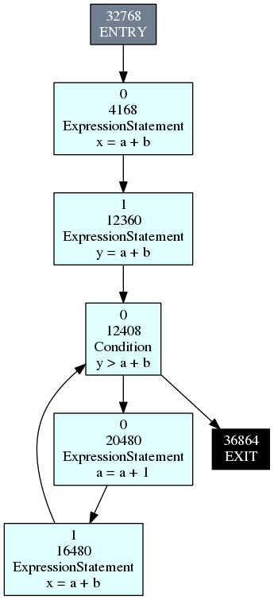

CFG Traversals
==============

A CFG is a *control flow graph*. The nodes in a control flow graph are blocks of code. The edges indicate the order in which these blocks of code can be executed. Joern creates a CFG of every function. In every function, there are two special nodes: the entry node and the exit node. The image below shows the CFG of the following code:

.. code-block:: c

        void popa_ex_2_5 ()
        {
                x = a+b;
                y = a+b;
                while (y>a+b) {
                        a = a + 1;
                        x = a + b;
                }
        }

Joern CFG structure
-------------------

To get to the CFG of a function, follow the edge labeled ``IS_FUNCTION_OF_CFG``.

The CFG edges have the label ``FLOWS_TO``. A CFG node can have multiple outgoing CFG edges, usually going out of a ``Condition`` node. Joern does not label these edges, so there is no easy way to determine whether following the edge indicates whether the condition was true or false.

*TODO: what is the edge property var used for?*

CFG nodes have the property ``isCFGNode`` set to ``'True'``. Even though every CFG node is also an AST node, a CFG is different from an AST in that it can have loops. This means that if we would try the same kind of loop that was used to traverse the AST, the traversal would continue looping until all the Octopus server's resources were exhausted. Since there is no way to kill a runaway traversal on the Octopus server other than restarting the server, we need to be very careful with our traversals.

Cycles and infinite loops
--------------------------

Fortunately, Gremlin offers a filter step called ``simplePath``. Every traverser (the bookkeeper that manages traversing the graph) keeps the current path that has been traversed. ``simplePath`` will filter out any objects that have a path with repeated objects in it. For example, this query will yield zero results:

.. code-block:: groovy

        g.V().has('type','FunctionDef')
        .in('IS_FUNCTION_OF_AST')
        .out('IS_FUNCTION_OF_AST')
        .simplePath()

We can use this step if we want to traverse the CFG without loops:

.. code-block:: groovy

        .emit()
        .repeat(
                out('FLOWS_TO')
                .simplePath()
        )
        .dedup()

There is only one problem with ``simplePath``: it filters out loops that occur anywhere in the traversed path, not just in the CFG. There is no method to 'reset' the path in a traversal or to manipulate it otherwise.
Fortunately, we can implement loop detection ourselves. Gremlin offers steps to
collect the objects in a traversal at a certain point. The ``aggregate`` `step <http://tinkerpop.apache.org/docs/3.0.1-SNAPSHOT/#aggregate-step>`_ and ``store`` `step <http://tinkerpop.apache.org/docs/3.0.1-SNAPSHOT/#store-step>`_ are used for this. The object collection can then be used in predicates such as ``without`` and ``within``.

For walking the CFG without loops, we now have:

.. code-block:: groovy

        addStep('walkcfg', {
                delegate
                .emit()
                .repeat(
                        aggregate('seen')
                        .out('FLOWS_TO')
                        .where(P.without('seen'))
                )
        })

Because we will only emit objects that have not been collected, we can remove the ``dedup`` step. The problem with collections however is that they persist. This means that if we would  call the step a second time, our collection ``seen`` would still contain the old values. Gremlin allows us to access the collections from the Groovy world, which means that we can reset the collection from a ``sideEffect`` step.

The traverser (remember, this is the bookkeeper that also records the paths) has a method called ``sideEffects`` (not to be confused with the step that is similarly named). This setter/getter method gives us access to the collections:

.. code-block:: groovy

        addStep('walkcfg', {
                delegate
                .sideEffect{ println "seen before " + it.sideEffects('seen') }
                .sideEffect{ it.sideEffects('seen',[]) }
                .sideEffect{ println "seen after " + it.sideEffects('seen') }
                .emit()
                .repeat(
                        aggregate('seen')
                        .out('FLOWS_TO')
                        .where(P.without('seen'))
                )
        })

You can see two extra ``sideEffect`` steps to trace what is happening to the collection. If we run this traversal, we can see that the collection is reset:

.. code-block:: none

        seen before []
        seen after []
        seen before [v[393288], v[430184], v[434224], v[811096], v[827480], v[381056], v[401408], v[389248]]
        seen after []

As long as we do not call our traversal recursively, this will work. If you use collections inside a user defined traversal, it is best to choose a unique enough name for the traversal, otherwise it may conflict with somebody else's collection.

Preparing for Reaching Definitions
-----------------------------------

One particular program analysis problem is called `Reaching Definitions <https://en.wikipedia.org/wiki/Reaching_definition>`_. In this analysis, it is necessary to know which CFG nodes assign to ('define') a variable. 

So, let's write a traversal that finds the defined variables in a given CFG node. Since every CFG node is also an AST node, we can generalize this problem to finding defined variables in any AST node. This is an exercise in the section on AST traversals.

Here we implement it as a step:

.. code-block:: groovy

        addStep('definedVariables', {
                delegate.emit(has('type','AssignmentExpression'))
                .repeat(
                        out('IS_AST_PARENT')
                )
                .lval()
                .values('code')
                .unfold()
        })

We have used the ``lval`` traversal from the standard library. We have also added an ``unfold`` step, which is a workaround for a problem that we will discuss soon.

Now, we would like to apply this function to all CFG nodes and combine the result with the CFG node, so that we can have a sort of lookup table. The outline of
the traversal is:

1. traverse to a function node
2. find all its CFG nodes ('statements')
3. for the node, apply ``definedVariables`` and collect the result
4. output the entry *( cfgnode, variables )*.

The first step is not hard, we simply use the lookup traversal ``getFunctionsByName`` from the standard library:

.. code-block:: groovy

        getFunctionsByName('tut5')

Then, we need to traverse all CFG nodes. For this we have written a traversal earlier, but one is defined in the standard library as ``functionToStatements``. It differs slightly from the above function in that it already traverses the ``IS_FUNCTION_OF_CFG`` edge for us.

.. code-block:: groovy

        .functionToStatements()

Next, we need to apply ``definedVariables``. We could just add this to the traversal, but then we would only get results for which the traversal yields results, i.e. we would only get results for the nodes that actually define variables. We are interested in all variables.

One way to apply a traversal is to use a ``map`` step. ``map`` takes a closure or other function that takes the traverser (remember, the bookkeeper, not the object) and turns it into any value. The function we want to apply however is a traversal, and traversals do not work on traversers! We could rewrite the traversal as a function, but there is an easier way.

The ``inject`` step can add objects into a traversal stream. Starting a traversal with ``inject`` means that we can turn one or more objects into a traversal stream. In other words, we are creating a subtraversal. So, ``inject(it.get())`` will start a subtraversal in which the object is the current object in our main traversal. We can then append ``definedVariables`` to it, but that will only have created the traversal, and will not have evaluated it. How do we get the results from the traversal back into our main stream?

Remember that traversals were iterators. In Groovy, there are many methods to evaluate an iterator. The simplest one is ``toList``, which will simply put all the objects into a list. There is also ``collect``, which can take a closure, which is useful if you want to modify the values before putting them into the list.

.. code-block:: groovy

        .map{ inject(it.get()).definedVariables().dedup().toList() }

Now there is only one part left: combining this result, which is now back in our main traversal, with the original cfg node. The shortest way is to modify the ``map`` step. This is left as an exercise. Instead, let's try the more complicated way so that we can learn more about Gremlin.

Remember that we can label the result of a traversal at one point, to use it later in the traversal. This was done using ``as`` and ``select``. Before we map, we label the result as ``cfgnode``, and after the map, we label it as ``vars``. Then all we need to do is ``select('cfgnode','vars')`` to get our mapping. The complete code now becomes:

.. code-block:: groovy

        getFunctionsByName('tut5')
        .functionToStatements()
        .as('cfgnode')
        .map{ inject(it.get()).definedVariables().dedup().toList() }
        .as('vars')
        .select('cfgnode','vars')

And the result will look like:

.. code-block:: none

        {cfgnode=v[393288], vars=[]}
        {cfgnode=v[430184], vars=[x]}
        {cfgnode=v[434224], vars=[]}
        {cfgnode=v[811096], vars=[]}
        {cfgnode=v[827480], vars=[]}
        {cfgnode=v[381056], vars=[x]}
        {cfgnode=v[401408], vars=[x]}
        {cfgnode=v[389248], vars=[]}

The Unfold Hack
---------------

Now, back to the ``unfold`` step. If you look up its `definition <http://tinkerpop.apache.org/docs/3.0.1-SNAPSHOT/#unfold-step>`_, you will see that it will 'flatten out' any iterator or list that is in the stream into multiple objects. But none of the traversals creates lists or iterators except where we explicitly said so (using ``toList``). Why add an ``unfold``?

It turns out that the values associated with the labels, in this case ``cfgnode``, would turn into a list of values after a repetition in which ``emit`` is used. You would see something like:

.. code-block:: none

        {cfgnode=v[393288], vars=[]}
        {cfgnode=[v[393288], v[430184]], vars=[x]}
        {cfgnode=[v[393288], v[430184], v[434224]], vars=[]}
        {cfgnode=[v[393288], v[430184], v[434224], v[811096]], vars=[]}
        {cfgnode=[v[393288], v[430184], v[434224], v[827480]], vars=[]}
        {cfgnode=[v[393288], v[430184], v[434224], v[811096], v[381056]], vars=[x]}
        {cfgnode=[v[393288], v[430184], v[434224], v[811096], v[401408]], vars=[x]}
        {cfgnode=[v[393288], v[430184], v[434224], v[827480], v[389248]], vars=[]}

This peculiar behaviour does not occur if we add an ``unfold`` step to a repetition that uses ``emit``. In the standard library, this has been done in ``functionToStatements``. It is good practice to do this for every repetition that uses ``emit``.

Exercises
---------

1.

        In the example of finding assigned variables in each CFG node, we
        mentioned that there was a shorter way by modifying the ``map`` step.
        Modify the ``map`` step so that we get the same result, i.e. for every
        CFG node we get a `Groovy Map <http://groovy-lang.org/groovy-dev-kit.html#Collections-Maps>`_ with keys ``cfgnode`` and ``vars``.

2.

        Write a traversal that outputs all CFG edges in a function.

